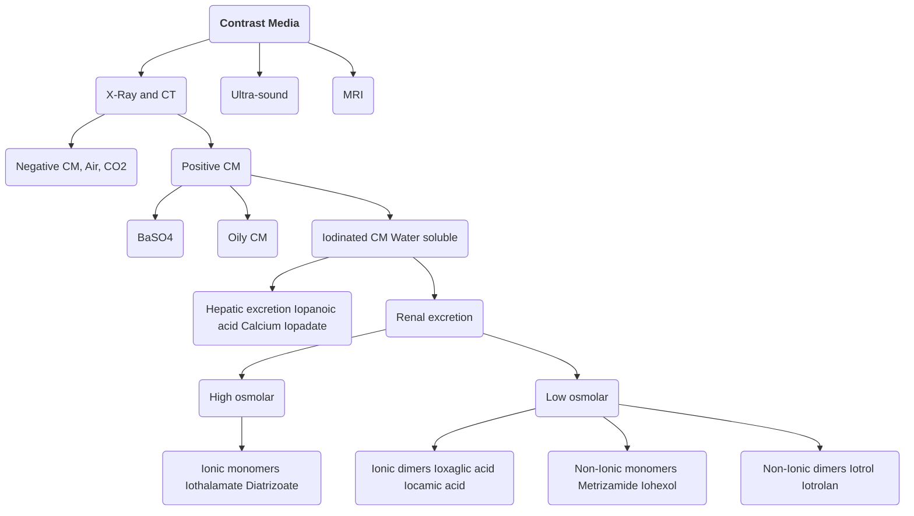

---
#### Atomic Number of Iodine is _53_
#### Atomic Weight of Iodine is _127_
#### Total Iodine content in Body is *50mg*
#### It is preferred because
- High contrast density due to _high atomic number_
- Low toxicity
#### It is not used in MRI

